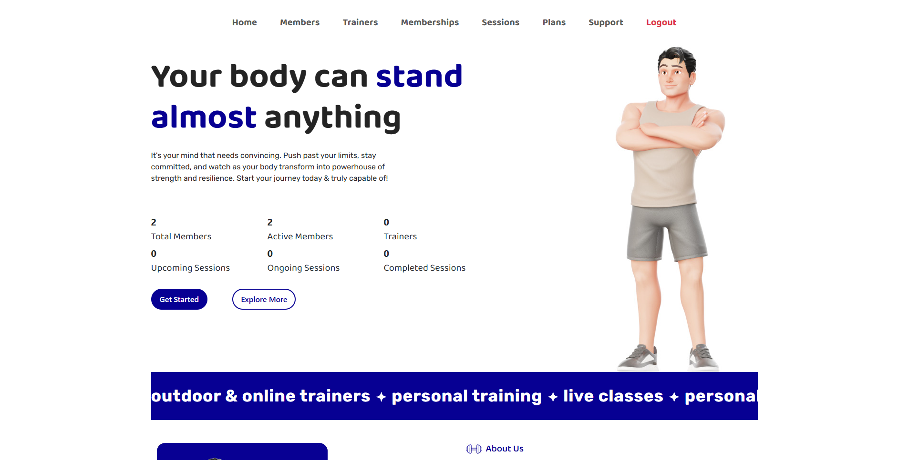
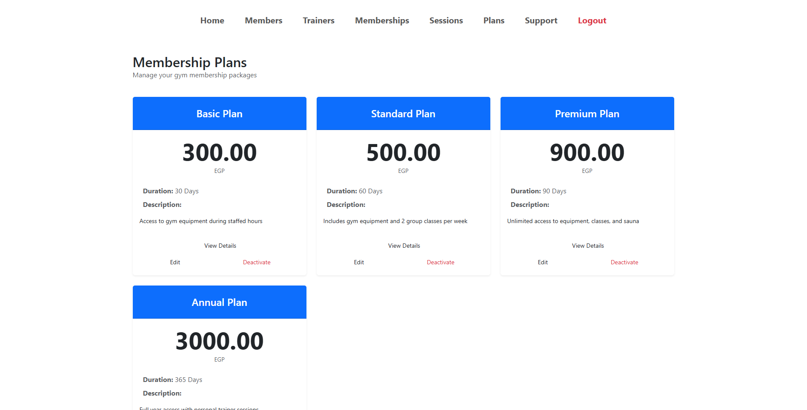
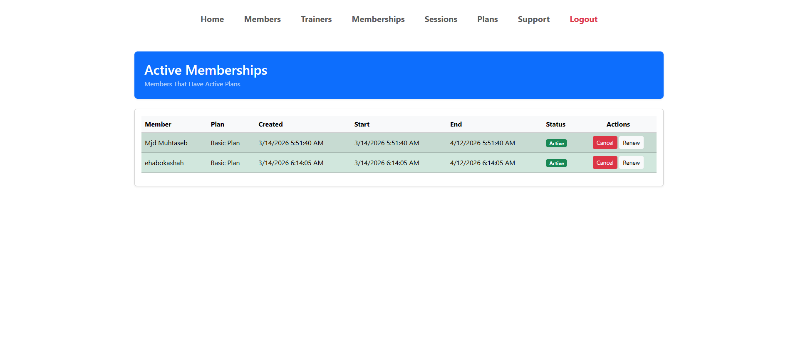
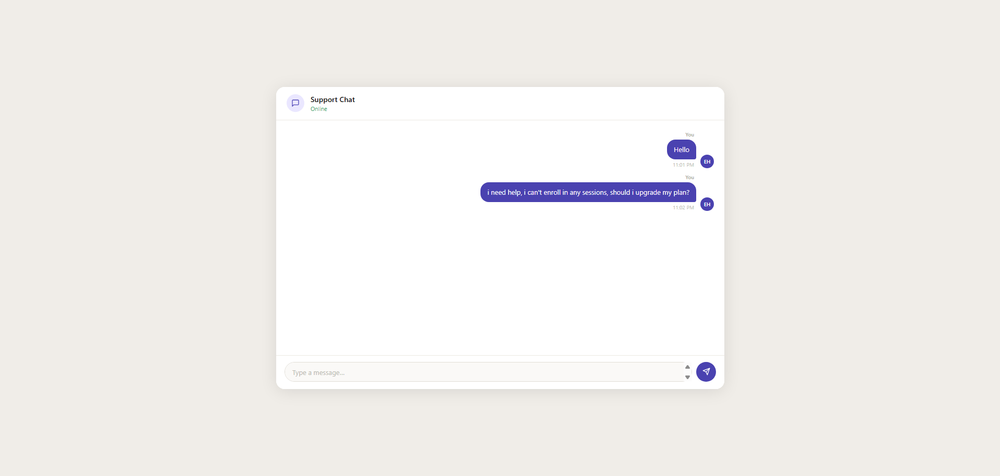
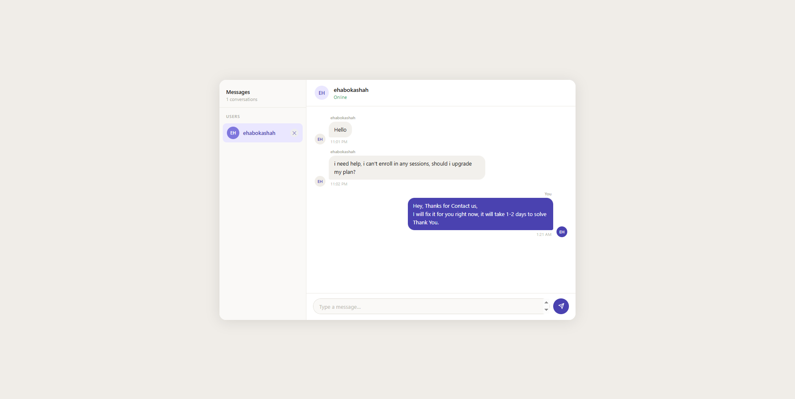
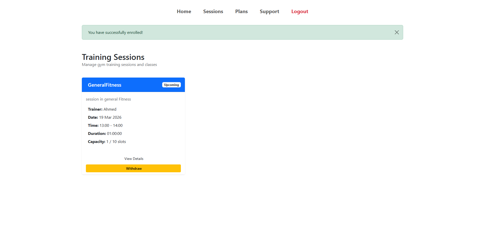

<div align="center">

# Gym Management System

**A full-featured desktop application for managing gym operations efficiently.**  
Built with **C#** · **ASP.NET** · **3-Layer Architecture**

[](https://learn.microsoft.com/en-us/dotnet/csharp/)
[](https://developer.mozilla.org/en-US/docs/Web/HTML)
[](https://developer.mozilla.org/en-US/docs/Web/CSS)
[](https://developer.mozilla.org/en-US/docs/Web/JavaScript)

</div>

---

## Screenshots


## Some System Screenshots

<div align="center">
  
  <br/><br/>
  
  <br/><br/>
  
  <br/><br/>
  
  <br/><br/>
  
  <br/><br/>
  
</div>

---

## 📖 About

The **Gym Management System** is a comprehensive solution designed to streamline the day-to-day operations of a gym or fitness center. It covers everything from member registration and subscription tracking to trainer management and reporting — all within a clean, organized interface.

---

## Features

- **Member Management** — Add, edit, and track gym members
- **Subscription Plans** — Manage membership types and durations
- **Trainer Management** — Assign trainers and manage schedules
- **Payment Tracking** — Monitor payments and renewals
- **Reports & Analytics** — Generate insightful reports on gym activity
- **User Authentication** — Secure login for admins and staff

---

## Architecture

This project follows a clean **3-Layer Architecture** for separation of concerns:

```
Gym-Management-System/
│
├── GymSystem/          #   Presentation Layer (UI)
├── GymSystemBLL/       #   Business Logic Layer
└── GymSystemDAL/       #   Data Access Layer
```

| Layer | Folder | Responsibility |
|-------|--------|----------------|
| Presentation | `GymSystem` | UI, Forms, User Interaction |
| Business Logic | `GymSystemBLL` | Rules, Validation, Workflows |
| Data Access | `GymSystemDAL` | Database Queries & Operations |

---

## Getting Started

### Prerequisites

- [Visual Studio 2019+](https://visualstudio.microsoft.com/)
- [.NET Framework](https://dotnet.microsoft.com/en-us/download/dotnet-framework)
- SQL Server (or SQL Server Express)

### Installation

1. **Clone the repository**
   ```bash
   git clone https://github.com/EhabOkashahh/Gym-Management-System.git
   ```

2. **Open the solution**
   ```
   Open GymSystem.sln in Visual Studio
   ```

3. **Configure the database**
   - Set up your SQL Server instance
   - Update the connection string in the DAL project

4. **Build & Run**
   ```
   Press F5 or click ▶ Run in Visual Studio
   ```

---

## Tech Stack

| Technology | Purpose |
|-----------|---------|
| C# | Core application logic |
| ASP.NET | Web framework |
| HTML / CSS | Frontend structure & styling |
| JavaScript | Client-side interactivity |
| SQL Server | Database |

---

## Contributing

Contributions are welcome! Feel free to:

1. Fork the project
2. Create a new branch (`git checkout -b feature/your-feature`)
3. Commit your changes (`git commit -m 'Add your feature'`)
4. Push to the branch (`git push origin feature/your-feature`)
5. Open a Pull Request

---

## Author

**Ehab Okasha**  
[](https://github.com/EhabOkashahh)

---

<div align="center">
  <sub>Made with ❤️ by Ehab Okasha</sub>
</div>
